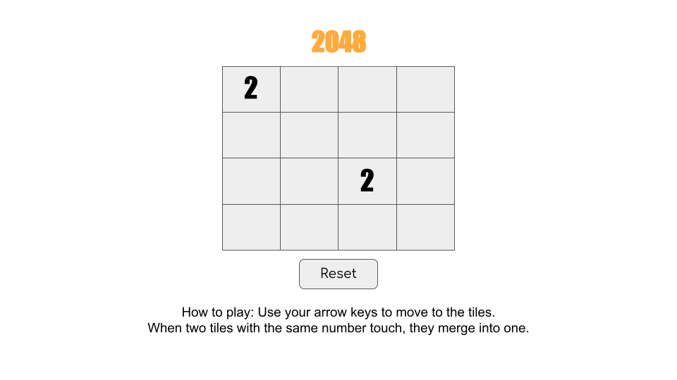

# 2048_Game
The objective of the game is to slide numbered tiles on a grid to combine them to create a tile with the number 2048
This video game was written by Italian web developer Gabriele Cirulli and published on GitHub

2048 is played on a plain 4×4 grid, with numbered tiles that slide when a player moves them using the four arrow keys.
Every turn, a new tile randomly appears in an empty spot on the board with a value of 2 
Tiles slide in the chosen direction until they are stopped by either another tile or the edge of the grid. 
If two tiles of the same number collide while moving, they will merge into a tile with the total value of the two tiles that collided.
The resulting tile cannot merge with another tile again in the same move. 

If a move causes three consecutive tiles of the same value to slide together, only the two tiles farthest along the direction of motion will combine. 
If all four spaces in a row or column are filled with tiles of the same value, a move parallel to that row/column will combine the first two and last two.

The game is won when a tile with a value of 2048 appears on the board. Players can continue beyond that to reach higher scores.
When the player has no legal moves (there are no empty spaces and no adjacent tiles with the same value), the game ends.

# User stories
As a player:
 * I want to see a boardgame on the screen (a 4X4 grid)
 * I want to see 2 number 2s displayed randomly on the grid
 * I want to see the numbers moving toward the right of the grid if I press the "right arrow key"
 * I want to see all the numbers moving down the grid if I press the "down arrow key"
 * I want to see the numbers moving toward the left of the grid if I press the "left arrow key"
 * I want to see all the numbers moving up the grid if I press the "up arrow key"
 * I want to see that two consecutive numbers that are the same add together and the result is displayed on the cell that is ocupied by the second number on the direction of the key that I had pressed
 * I want to see an empty cell where the first number was before the adding the two equal consecutive numbers
 * I want to see a number 2 dispayed at random on one of the empty cells
If there are not more empty cells, the game is over..
 * I want to seee a display letting me know that the game is over if I can't make another move
 * I want to see a display of winning if I get to reach the 2048 in a cell
  

# Better version:
If there are some possible additon on the grid, the computer shoud add them when I keep pressing the arrow keys and the game should be over when I cannot add more numbers and there are not more empty cells.

